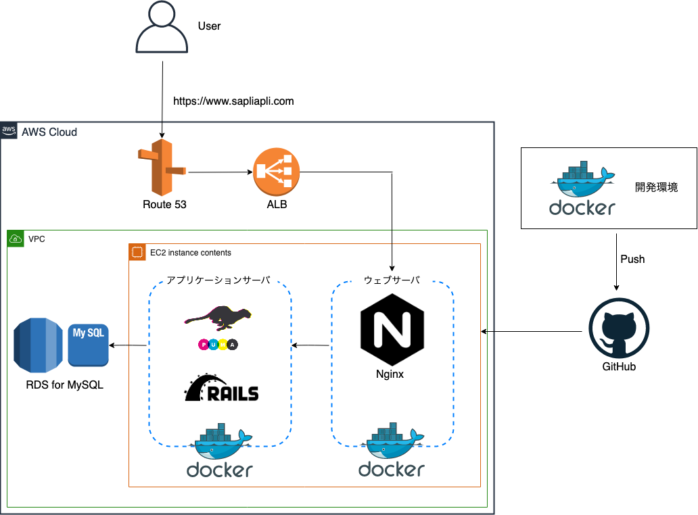

# サプリアプリ
サプリメントのレビューサイトです。

「サプリメントの評価」と「感想の投稿」を共有することができます。

URL: https://www.sapliapli.com

# 使用技術
- インフラ
  - AWS ( EC2 / ALB / Route53 / RDS / VPC )

- フロントエンド
  - HTML
  - CSS
  - JavaScript
  - jQuery

- バックエンド
  - Ruby 2.6.3
  - Rails 6.0.3

- Webサーバ
  - Nginx

- APサーバ
  - Puma

- データベース
  - RDS for MySQL 5.6.1

- 開発環境
  - Docker

# AWS構成図

# 機能一覧
- ユーザ登録関連
  - ユーザ登録機能
  - パスワード再設定機能
  - Remember me機能
  - 簡易ログイン機能（ゲストユーザ機能）

- 投稿関連
  - 画像投稿機能
  - つぶやきの投稿機能
  - サプリの投稿機能
  - サプリの評価点登録機能
  - サプリのレビュー機能

- その他
  - サプリの評価点ランキング機能
  - サプリのお気に入り登録機能
  - ユーザフォロー機能
  - フォローユーザのフィード表示機能